  

  

## 📌 About Me
- 🌱 I’m currently learning Data Structures, Algorithms, and exploring AI/ML
- 🤝 I’m looking to collaborate on real-world projects and innovative ideas
- 💡 I enjoy solving problems and building useful applications
- 🚀 Always curious to learn new technologies and improve my skills
- 🎯 Goal: To become a skilled developer and build impactful products

## 🧠 My Focus Areas
- Web Development
- Java & DSA
- AI/ML Exploration
- Open Source Contribution
- Problem Solving & Competitive Coding

## 📊 GitHub Stats & Trophies

  
  

  

  

  

## 🛠️ Languages & Tools

> ## Programming Languages

   

> ## Frontend

  

> ## Backend

> ## Database

 

> ## DevOps & Cloud

> ## Tools

    

  

## 🔗 Connect with Me

   

<picture>
  <source media="(prefers-color-scheme: dark)" srcset="https://raw.githubusercontent.com/abozanona/abozanona/output/pacman-contribution-graph-dark.svg">
  <source media="(prefers-color-scheme: light)" srcset="https://raw.githubusercontent.com/abozanona/abozanona/output/pacman-contribution-graph.svg">
  
</picture>

  

